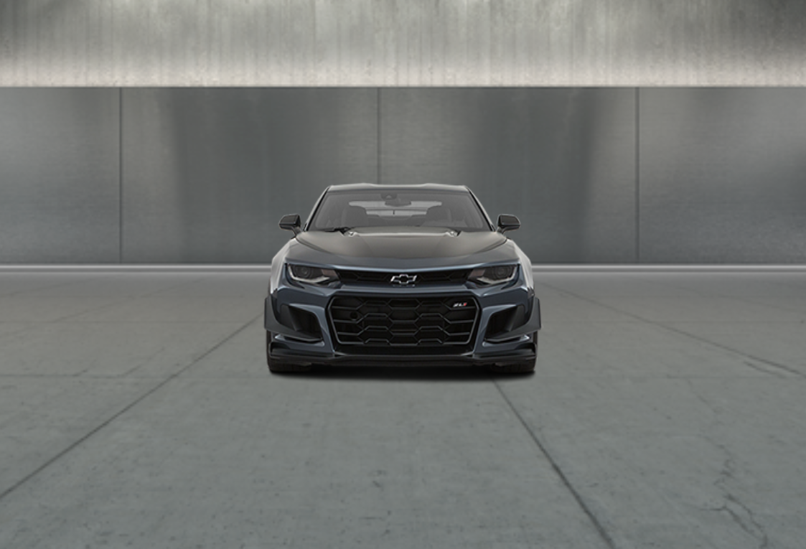
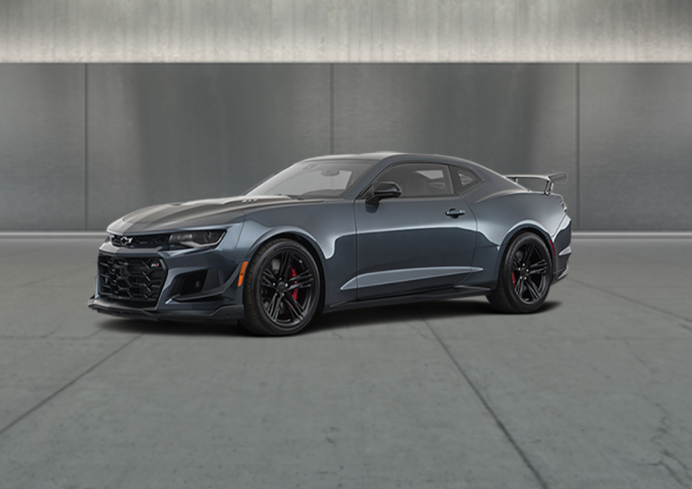

## aframe-spin-frames-component

A Spin Frames component to load Evox Images exterior vehicle assets

For [A-Frame](https://aframe.io).

  - [API](#api)
  - [Installation](#installation)
    - [Browser](#browser)

### API

| Property    | Description                                                                       | Default Value |
| ----------- | --------------------------------------------------------------------------------- | ------------- |
| folder      | Path to local asset folder  (`required`)                                          | ' '           |
| urls        | An array of file paths to load as textures (`required`)                           |               |
| clickToSpin | Enable click to spin vehicle (**`clickable` class on parent `<a-image>` required) | false         |
| sensitivity | Spin velocity                                                                     | 3.2           |
| frameIndex  | Angle of starting image frame (out of 36)                                         | 24            |
| vifnum      | Vehicle ID                                                                        | ' '           |
| eye         | Left or right eye asset                                                           | left          |

### Installation

#### Browser

Install and use by directly including the [browser files](dist):

### Usage

```html
<head>
  <title>My A-Frame Scene</title>
  <script src="https://aframe.io/releases/0.8.2/aframe.min.js"></script>
  <script src="aframe-spin-frames-component.min.js"></script>
</head>

<body>
  <a-scene id="a-scene" rotation="0 0 0" vr-mode-ui="enabled: true">
      <a-image
        class="clickable"
        scale="10 10 10"
        position="0 1.5 -4"
        material="shader:flat;"
        spin-frames="folder:./AIL13225_1024;
        urls:/AIL13225_left_010.png,/AIL13225_left_020.png,/AIL13225_left_030.png,/AIL13225_left_040.png,/AIL13225_left_050.png,/AIL13225_left_060.png,/AIL13225_left_070.png,/AIL13225_left_080.png,/AIL13225_left_090.png,/AIL13225_left_100.png,/AIL13225_left_110.png,/AIL13225_left_120.png,/AIL13225_left_130.png,/AIL13225_left_140.png,/AIL13225_left_150.png,/AIL13225_left_160.png,/AIL13225_left_170.png,/AIL13225_left_180.png,/AIL13225_left_190.png,/AIL13225_left_200.png,/AIL13225_left_210.png,/AIL13225_left_220.png,/AIL13225_left_230.png,/AIL13225_left_240.png,/AIL13225_left_250.png,/AIL13225_left_260.png,/AIL13225_left_270.png,/AIL13225_left_280.png,/AIL13225_left_290.png,/AIL13225_left_300.png,/AIL13225_left_310.png,/AIL13225_left_320.png,/AIL13225_left_330.png,/AIL13225_left_340.png,/AIL13225_left_350.png,/AIL13225_left_360.png;clickToSpin:true;">
      </a-image>
    <a-entity custom-cubemap="folder:showroom_ext;background:true"></a-entity> 
    <a-camera fov="80" look-controls="enabled:true" wasd-controls="enabled:false">
    </a-camera>
  </a-scene>
</body>
```




