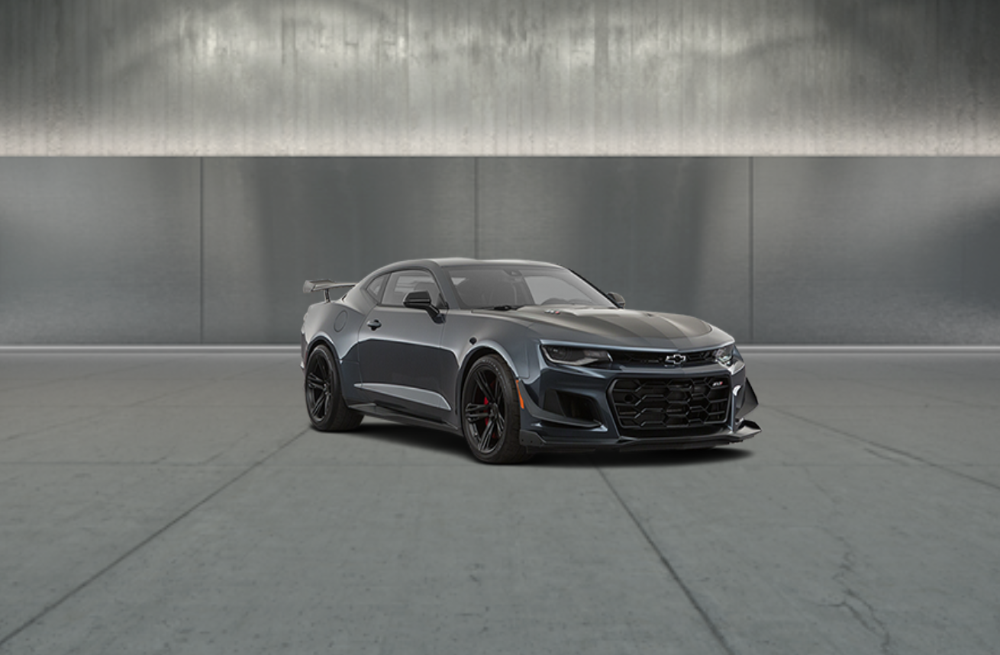

## aframe-spin-frames-component

A Spin Frames component to load Evox Images exterior vehicle assets

For [A-Frame](https://aframe.io).

  - [API](#api)
  - [Installation](#installation)
    - [Browser](#browser)

### API

| Property    | Description                                                 | Default Value |
| ----------- | ----------------------------------------------------------- | ------------- |
| folder      | Path to local asset folder                                  | ' '           |
| clickToSpin | Enable click to spin vehicle (**`clickable` class required) | false         |
| sensitivity | Spin velocity                                               | 3.2           |
| frameIndex  | Angle of starting image frame (out of 36)                   | 24            |

### Installation

#### Browser

Install and use by directly including the [browser files](dist):

### Usage

```html
<head>
  <title>My A-Frame Scene</title>
  <script src="https://aframe.io/releases/0.8.2/aframe.min.js"></script>
  <script src="aframe-spin-frames-component.min.js"></script>
</head>

<a-scene id="a-scene" rotation="0 180 0" vr-mode-ui="enabled: false">
    <a-image class="clickable" scale="10 10 10" position="0 1.5 -4" spin-frames="folder:./AIL13225_1024/; clickToSpin:false; vifnum:13225;"></a-image>
    <a-camera fov="80" look-controls="enabled:false" wasd-controls="enabled:false">
    </a-camera>
    <a-sky color="#fff"></a-sky>
  </a-scene>
```



